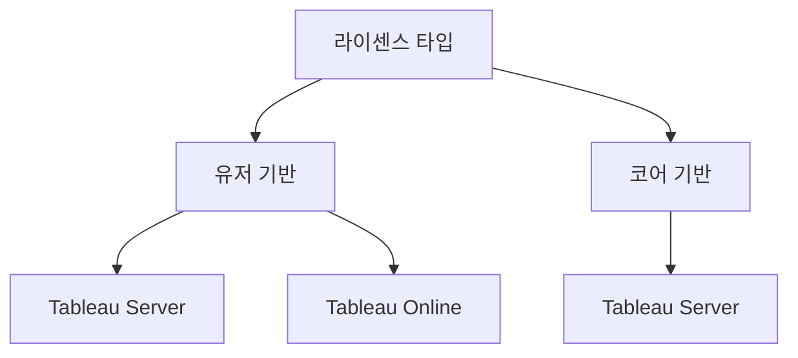

## Tableau가 뭐에요?

운영 중인 제품이나 사용자 퍼널 데이터 등을 수집해 분석하고 시각화하는 BI<sup>Business Intelligence</sup> 도구 중 하나입니다. 보통 BI 3대장이라고 하면 Tableau, Power BI, Qlik이라고들 하더라구요. 단순히 시각화해주는 도구에서부터 데이터 파이프라인 구축까지도 BI와 함께 꾀할 수 있습니다.

국내에서는 8퍼센트가 기술 블로그를 통해 Tableau를 사용한다고 언급하고 있습니다. 상용 BI를 도입할 정도 기업이라면 다음과 같은 이유들이 있습니다.

첫번째, 리포팅입니다. 경영진은 비즈니스 규모가 커질 수록 마이크로한 부분을 볼 여력이 줄어듭니다. KPI 달성 여부를 확인하기 위해 시각화한 리포트를 요청하게 될 것입니다. 매주, 매달 받는 보고서로는 가장 최신의 데이터를 사용하는지 알 수 없기 때문에 실시간성을 가진 데이터를 확인하고 대시보드를 배포하기 위해 BI 도입을 고려합니다.

두번째, 손쉬운 데이터 쿼리 기능입니다. 여러 시스템의 데이터를 모아 DW<sup>Data Warehouse</sup>를 구성했다면 당연히 요리조리 쿼리를 날려보면서 데이터를 분석하고 싶을 것입니다. 당연히 DB 클라이언트에서 직접 쿼리를 실행해보거나 노트북 환경에서 플로팅해보는 것도 좋은 방법일 수 있습니다. 비개발자들의 한계를 극복하기 위해 BI 도입을 고려합니다.

세번째, EDA<sup>Exploratory Data Analysis</sup>도 손쉬운 데이터 쿼리와 비슷한 맥락입니다. 보통 주피터같은 노트북 환경에서 EDA를 도와주는 pandas-profiling으로 데이터를 플로팅해봅니다. 노트북이 고사양 서버에 올라가있지 않아서 로컬에서 구동하는 경우는 한계가 명확합니다. 아주 부수적인 목적으로 EDA를 위해 BI를 도입할 수도 있을 것 같습니다.

그래서 뭐 할 때 쓰는 녀석이냐구요?

시각화한 데이터로 의사 결정을 내리기 위한게 가장 큰 목적이고, 데이터 파이프라인은 부가적으로 따라오는 요소라고 생각하면 좋습니다.

## Tableau 라이센스

### 라이센스 타입

[태블로 글로벌](https://www.tableau.com/pricing/teams-orgs)에서 구입해도 되지만, 한국어 기술지원 및 교육을 지원받기 위해서는 국내 총판 업체를 이용하는 것이 낫습니다. 라이센스는 유저 기반 라이센스와 코어 기반 라이센스가 있습니다.



유저 기반 라이센스는 사용자별 역할에 따라 비용을 지불하는 방식으로, Tableau Server와 Online 모두에서 쓸 수 있습니다. 게스트 접근은 불가능하고, 보통 500명 미만의 소규모 조직에서 씁니다. 권한은 Creator, Explorer, Viewer 세 가지로 나뉩니다.

코어 기반 라이센스는 서버에 설치된 코어 수만큼 라이센스를 구입하는 방식입니다. Explorer와 Viewer는 수 제한이 없지만, Creator는 별도로 구입해야 합니다. Tableau Server에서만 사용 가능하고, 게스트 접근을 허용할 수 있다는 게 유저 기반과의 차이점입니다. 대규모 조직(1000명 이상)을 타깃으로 하는데, 하니웰, 루프트한자, 찰스슈왑, 레노버, 링크드인이 대표 고객사로 소개되고 있을 지경이니 중소기업에서 쓸 생각은 포기하는게 낫습니다. 금액은 1억 이상으로 알고 있습니다.

### 라이센스 가격 정책

유저 기반은 Creator $70/m, Explorer $35/m, Viewer $12/m이고, 코어 기반은 Creator 기준 $75/m입니다.

## 배포판 종류

배포 환경에 따라 Tableau Server, Tableau Online, Tableau Desktop 세 가지로 나뉩니다. Tableau Server는 온프레미스에 직접 설치하는 방식으로, 유저 기반과 코어 기반 라이센스를 모두 쓸 수 있고 다차원 데이터 소스 연결도 됩니다. Tableau Online은 Tableau에서 관리하는 SaaS 형태로, 유저 기반 라이센스만 지원하고 온프레미스 데이터소스 직접 연결은 불가능합니다. Tableau Desktop은 워크북 제작 및 서버 게시를 위한 클라이언트 앱입니다.

### 설치 방법

Tableau Server는 온프레미스 Linux 서버에 rpm이나 deb 패키지로 설치합니다. CentOS/RHEL이면 `yum`, Ubuntu면 `apt`를 쓰면 됩니다.

```sh
# CentOS/RHEL
sudo yum install tableau-server-<version>.x86_64.rpm

# Ubuntu
sudo apt install ./tableau-server-<version>_amd64.deb
```

설치하면 TSM<sup>Tableau Services Manager</sup>이라는 관리도구가 같이 깔립니다. CLI와 웹 UI(기본 8850포트) 두 가지로 접근할 수 있고, 초기 설정이랑 라이센스 활성화도 여기서 합니다. 변경사항을 적용하면 서버가 재시작되니까 운영 중이라면 점검 시간에 작업하는게 좋습니다.

```sh
tsm licenses activate -k <product-key>
tsm pending-changes apply
```

Tableau Desktop은 버저닝이 좀 특이한데, major 버전 자리에 연도를 씁니다 (예: 2022.3, 2023.1). 라이센스가 없어도 14일은 트라이얼로 쓸 수 있고, Server에 연결하면 거기 올라간 데이터소스를 Desktop에서 바로 가져다 쓸 수 있어서 편합니다.

### 워크북 게시

Tableau Desktop에서 만든 대시보드 묶음을 워크북이라고 부릅니다. 파일 확장자는 `.twb`랑 `.twbx` 두 가지인데, `.twb`는 데이터소스 연결 정보만 담고 있고 `.twbx`는 데이터 추출 파일까지 같이 묶어서 가지고 있습니다. 보통 서버에 올릴 때는 `.twbx`를 씁니다.

50MB 미만이면 Tableau Server 웹 UI에서 직접 업로드할 수 있고, 그 이상 되는 큰 워크북은 Desktop에서 **서버 > 워크북 게시** 메뉴를 통해서만 올릴 수 있습니다.

### 임베딩

워크북 공유하기를 클릭하면 iframe 링크랑 JavaScript API 내장코드 두 가지 방식으로 외부에 임베딩할 수 있습니다.

iframe 방식은 가장 간단합니다. 공유 URL을 그대로 `src`에 넣으면 됩니다.

```html
<iframe
  src="https://tableau.example.com/views/Dashboard/Sheet1"
  width="100%"
  height="600px"
  frameborder="0"
></iframe>
```

JavaScript API 방식은 Tableau에서 제공하는 Embedding API를 스크립트로 로드해서 사용합니다. iframe보다 세밀한 제어가 가능하고, 필터 조작이나 이벤트 처리 같은 인터랙션을 구현할 수 있습니다.

```html
<script
  type="module"
  src="https://tableau.example.com/javascripts/api/tableau.embedding.3.latest.min.js"
></script>

<tableau-viz
  id="tableauViz"
  src="https://tableau.example.com/views/Dashboard/Sheet1"
  width="100%"
  height="600px"
></tableau-viz>
```

근데 막상 임베딩해보면 바로 쓸 수 있을 것 같지만 로그인 프롬프트가 떡하니 나옵니다. Tableau Server가 인증되지 않은 외부 요청을 기본적으로 차단하기 때문입니다. 이걸 우회하는 방법이 게스트 사용자 액세스(코어 기반 라이센스 전용), Trusted Authentication, SSO(SAML/OpenID Connect) 세 가지인데, 다음 포스트에서 Trusted Auth 구현을 다룹니다.
